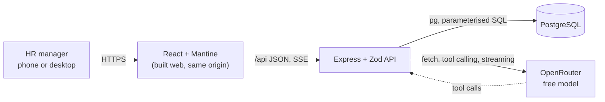

# ACME Salary Management: journey

The master record, from the first prompt to the deployed app. Append only: a changed
decision gets a new entry. Commit hashes are copied from `git log`. Anything unverified is
labelled **unverified**.

Contents: 1 Brief · 2 Prompt log · 3 Timeline · 4 Decision log · 5 Architecture, data model
and API · 6 Trade-offs · 7 Performance · 8 Testing strategy · 9 AI usage · 10 Deliberately
left out · 11 Deployment · 12 Retrospective

---

## 1. Brief

Replace ACME's Excel salary sheets. ACME's HR manager (one user, on phone and desktop, knows
the organisation but not SQL) manages pay for 10,000 employees across six countries (US, IN,
GB, DE, BR, JP), and asks a pay assistant questions about how the organisation pays people.

Features: find employees (server-side search, filter, sort, paging, state in the URL); add
and change employees (validated forms, effective-dated job and salary history, immutable code
and hire date, stale saves refused); record leavers (mark and undo, nothing deleted); ask about
pay (read-only tool-using assistant on a free OpenRouter model, sources shown, says plainly
when the data can't answer); Excel round trip (CSV export of the filtered list, all-or-nothing
CSV import with preview and per-row errors); deterministic seed of exactly 10,000 people.

Rules: currencies never mixed or converted; median with min, max and headcount; money as
integers; WCAG AA. Full text: `requirements.md` (P1).

---

## 2. Prompt log

Nikhil's messages verbatim and numbered, each followed by "My reply". Questions asked through
the question dialog are logged with their answers under the message they belong to.

> **Logging note:** P2 and P3 arrived while the session was in plan mode, which only allows
> writing the plan file. They were recorded in the plan file as they happened and transcribed
> here at set-up, so they were acted on (questions asked) before being logged in this file.

### P1: `requirements.md`

The requirements file as provided (committed alongside this journal, unchanged).

**My reply:** read it in full; it drove every question below.

### P2

> I have the rquiremernts in the requirements.md file. I want you to go ahead and check it out. and lets plan the website first. Feel free to ask any questions. DOnt assume anything. in doubt? always ask me

**My reply:** read `requirements.md`; checked tooling (Node 24.13.1, npm 11.8.0, no pnpm,
Docker 28.1.1, Docker Compose v2.35.1, git 2.50.1, `~/.ssh/id_personal` present, global git
email is a work address); listed free tool-capable OpenRouter models; classified the work as
architectural (new project); wrote back my understanding; asked the questions below. No
subagents used during planning.

**Round 1** (question dialog; answers verbatim)

| # | Question | Options offered | Answer |
|---|---|---|---|
| Q1 | What should this planning pass produce before we stop again? | Phases 1–4, then stop (Recommended) · Phases 1–4 + screen wireframes · Chat plan only for now | "Phases 1–4, then stop (Recommended)" |
| Q2 | The app will be deployed on Render (public URL) and calls OpenRouter with your key. Should it require a login? | Single password (Recommended) · No login · Username + password in DB | "Single password (Recommended)" |
| Q3 | Do you already have an OpenRouter account and API key? | Yes, I'll put it in .env · No, I'll create one myself · No, you sign up (I approve) | "Yes, I'll put it in .env" |
| Q4 | What should CSV import do? | Create new employees only (Recommended) · Create + update by employee code · Update only | "Create new employees, if it has some overlapping codes or other unique fields reject the csv. csv rle is either all gets uploaded or nothing. do mention the things why csv failed." |

**Round 2** (Nikhil answered two, then stopped the dialog to clarify)

| # | Question | Options offered | Answer |
|---|---|---|---|
| Q5 | Which fields must be unique per employee (so CSV import rejects duplicates against the database and within the file)? | Code + work email (Recommended) · Code + email + full name · Employee code only | "Code + work email (Recommended)" |
| Q6 | Besides code, name, country, job, salary, hire date and leaver status, which extra fields should an employee have? (multi-select) | Department + level · Gender · Work email · Manager | "Department + level, Gender, Work email, Manager" |
| Q7 | How should the pay assistant conversation work? | Multi-turn, not saved (Recommended) · One question, one answer · Multi-turn, saved history | Not answered in the dialog; answered by P3 |
| Q8 | Which genders should the data model support? | Female / Male / Non-binary · Female / Male · Don't store gender | Not answered; re-asked as Q10 |
| Q8a | What would you like to clarify? (The assistant question · The gender question · One of my answered ones · How I'm asking questions) | | Declined the dialog; Nikhil wanted to type freely. I asked in plain text instead. |

### P3

> if we dont save history will on refresh it will go away ? I think we should maintain multiple chat windows and maintain history I feel like. just like we have chatgpt we can keep multiple chats right. so in similar way we should implemnent it and maintaining history as well.

**My reply:** confirmed that unsaved chats disappear on refresh. Decided with Nikhil:
ChatGPT-style multiple chats, stored in Postgres, each answer stored with the sources it was
based on so reopened chats show what they said and why. Continued the questions:

**Round 3**

| # | Question | Options offered | Answer |
|---|---|---|---|
| Q9 | What can HR do with saved chats? | Auto-title, rename, delete (Recommended) · Auto-title, rename, archive · Auto-title only | "Auto-title, rename, delete (Recommended)" |
| Q10 | Which gender values should the data model support? | Female / Male / Non-binary · Female / Male | "Female / Male / Non-binary" |
| Q11 | How should Manager work? | Part of job history (Recommended) · Plain current field | "Part of job history (Recommended)" |
| Q12 | What kind of company is ACME, so I can pick realistic departments, roles and levels? | Tech/software company · Manufacturing · Retail / consumer | "Tech/software company" |

**Round 4**

| # | Question | Options offered | Answer |
|---|---|---|---|
| Q13 | What salary figure does the app store and compare? | Annual base salary (Recommended) · Monthly base salary · Annual base + bonus target | "Annual base salary (Recommended)" |
| Q14 | How should the 10,000 employees be split across countries? | US 3000 / IN 3000 / GB 1200 / DE 1200 / BR 800 / JP 800 · Even split | "US 3000 / IN 3000 / GB 1200 / DE 1200 / BR 800 / JP 800" |
| Q15 | How should Japanese names be written? | Romaji, given then family (Recommended) · Romaji, family then given · Kanji | "Romaji, given then family (Recommended)" |
| Q16 | Which effective dates can a job/salary/manager change have? | Past or future (Recommended) · Today or past only · Past or future, rows editable | "Past or future (Recommended)" |

**Round 5**

| # | Question | Options offered | Answer |
|---|---|---|---|
| Q17 | Salaries can't be compared across currencies. How should salary sort and the salary-range filter behave on the employee list? | Only with one country chosen (Recommended) · Group by currency, then sort · No salary sort/filter in the list | "Only with one country chosen (Recommended)" |
| Q18 | Where should pay statistics (median, min, max, headcount) appear outside the assistant? (multi-select) | Summary on the filtered list · Pay overview page · Employee page vs peers | "Employee page vs peers, Pay overview page, Summary on the filtered list" |
| Q19 | What is recorded when someone leaves, and how does it affect the rest of the app? | Leave date + optional reason (Recommended) · Leave date only | "Leave date + optional reason (Recommended)" |
| Q20 | Local git identity for this repo (your global email is your work one)? | Personal email + Claude trailer (Recommended) · Personal email, no trailer | "Personal email + Claude trailer (Recommended)" |

Before round 6 I posted a draft assistant design in chat (fixed tools `find_employees`,
`get_employee`, `pay_stats`, `find_outliers`; taxonomy in the system prompt; server-built
"Based on" panel; plain `fetch` to OpenRouter; 429 handling; about 2–4 model requests per
question).

**Round 6**

| # | Question | Options offered | Answer |
|---|---|---|---|
| Q21 | Which kinds of questions must the pay assistant handle? (multi-select) | Pay stats by group · Find and compare people · Outliers vs peers · Changes over time | "anything, we should provide the assistant with the data, AI model will figure out on its own how to do calculation based on that data" |
| Q22 | How should an answer appear while the assistant works? | Progress steps, then answer (Recommended) · Stream words as they arrive | "Stream words as they arrive" |
| Q23 | Can an employee's country change (relocation)? Salary currency would change with it. | No, country is fixed (Recommended) · Yes, as a dated job change | "Yes, as a dated job change" |
| Q24 | Look and feel for the UI? | Calm, data-dense, light + dark (Recommended) · Light theme only · I'll share references | "Calm, data-dense, light + dark (Recommended)" |

Before round 7 I flagged two problems with sending raw data for the model to compute on:
all 10,000 rows as CSV would be roughly 250–300k tokens (**unverified** rough estimate,
not measured), past most free models' context and expensive on the free quota; and models
miscompute medians over thousands of numbers.

**Round 7**

| # | Question | Options offered | Answer |
|---|---|---|---|
| Q25 | How should the assistant get data so it can answer 'anything'? | Flexible data tools + exact maths tool (Recommended) · Raw rows only, model does maths · Fixed question-type tools | "Flexible data tools + exact maths tool (Recommended)" |
| Q26 | Free OpenRouter model providers may log prompts or use them for training. What may the assistant send them? | Everything; data is fictional (Recommended) · No names or emails | "Everything; data is fictional (Recommended)" |
| Q27 | When someone relocates (country changes), what must the same change include? | New salary in new currency (Recommended) · Salary optional | "New salary in new currency (Recommended)" |

**Round 8**

| # | Question | Options offered | Answer |
|---|---|---|---|
| Q28 | Employee codes: who assigns them, and what format? | App suggests next, HR can edit (Recommended) · Always auto-generated · HR always types it | "App suggests next, HR can edit (Recommended)" |
| Q29 | Should the seed contain a realistic gender pay gap, so pay-gap questions have something to find? | Small gap, varies by country · No gap | "Small gap, varies by country" |
| Q30 | How much past history should seeded employees have? | Realistic history (Recommended) · Hire record only | "Realistic history (Recommended)" |
| Q31 | How many seeded people should be paid far from their peers? | About 30 (Recommended) · About 10 · About 100 | "About 30 (Recommended)" |

**Round 9**

| # | Question | Options offered | Answer |
|---|---|---|---|
| Q32 | Can hire dates and leave dates be in the future (accepted offer, notice period)? | Yes, both (Recommended) · No, today or earlier only · Future hire only | "Yes, both (Recommended)" |
| Q33 | Deployment shape on Render (deploy itself still needs your approval later)? | One service: API serves the web build (Recommended) · Static site + API service | "One service: API serves the web build (Recommended)" |

Then I wrote the plan (phases 1–4, design, defaults) and asked for approval.

### P4: plan approval

Approved through the plan-approval dialog; no typed text. No "pause after SPEC" was
requested, so the next stop is after the plan in `tasks/todo.md`.

**My reply:** started phase 1 (set-up). While writing `CLAUDE.md` I found that the
requirements' "a `test(...)` commit (red)" and "commit only when the tests pass" contradict
each other literally, and asked:

| # | Question | Options offered | Answer |
|---|---|---|---|
| Q34 | The requirements say each behaviour gets a red test(...) commit, and also 'commit only when the tests pass'. How should red commits work? | Expected-to-fail marker (Recommended) · Red commit may fail, only on the new test | "Expected-to-fail marker (Recommended)" |

Set-up done in the commit "chore: project set-up and brainstorm record" (hash recorded in the
next timeline entry).

Phase 3 (requirements), still under P4:
- Loaded the `llm-security` skill (OWASP LLM Top 10) before writing the assistant criteria;
  applied: read-only tools in a read-only transaction, typed tool arguments, no secrets in
  the system prompt, model HTML never rendered, caps on tool rounds, rows and history length.
- Started a background research subagent for pay bands (prompt in section 9).
- While writing `docs/SPEC.md` I found that full-snapshot history rows break when a change is
  added before an already-scheduled one, and asked:

| # | Question | Options offered | Answer |
|---|---|---|---|
| Q35 | A raise to 110,000 is scheduled for 1 Jan. Today HR adds a promotion (new role, salary 105,000) effective 1 Nov. What should 1 Jan look like? | Each change keeps only what it changed (Recommended) · Refuse it | "Each change keeps only what it changed (Recommended)" |
| Q36 | History entries are never edited. Can HR cancel a change that's scheduled for the future (e.g. a raise entered by mistake)? | Yes, cancel scheduled only (Recommended) · No cancelling | "Yes, cancel scheduled only (Recommended)" |

Phase 4 (plan), still under P4:
- Used `superpowers:writing-plans`; the plan lives in `tasks/todo.md` as the requirements
  say (the skill's default location is overridden).
- 29 tasks in build order: backend (1–19, plus a manual model smoke test), UI (20–26), end to
  end and CI (27–29). Each test is named and tied to its criterion ids.
- Checked mechanically: all 85 criterion ids in `docs/SPEC.md` appear in `tasks/todo.md`
  (bash loop over the ids; 0 missing). AST-10 is covered by manual QA only, against the real model.
- Deviation from the skill, flagged to Nikhil: the skill wants code in every step now. The
  plan names files, interfaces and tests, and writes each task's code-level steps just before
  the task starts, so they're based on the interfaces that exist by then.
- Advisor review before the stop caught that LIST-9 and STATS-2 disagreed on counting
  starting people; fixed in d4b6938.

Stop after the plan (question dialog):

| # | Question | Options offered | Answer |
|---|---|---|---|
| Q37 | Which timezone decides 'today' (status, when scheduled changes start applying, stats)? HR could be in any of the six countries. | Setting, default UTC (Recommended) · Always UTC · HR's browser timezone | "HR's browser timezone" |
| Q38 | How should the build (phase 5) be run? | Native (Recommended) · Subagent-driven | "Native (Recommended)" |
| Q39 | The planning skill wants code-level steps for every task written now. When should they be written? | Just before each task (Recommended) · All now, before building | "Just before each task (Recommended)" |
| Q40 | Do you approve docs/SPEC.md and tasks/todo.md? | Approve, start building · I'll read the files first | "Approve, start building" |

Follow-up: added TIME-1 to `docs/SPEC.md` (browser timezone via `X-Timezone`, UTC
fallback), changed the planned clock interface and Task 1/20 tests, and updated `CLAUDE.md`.
Then started phase 5.

---

## 3. Timeline

| Date | What happened | Commits |
|---|---|---|
| 2026-10-04 | P1 + P2: read requirements, checked tooling and OpenRouter models, brainstorm rounds 1–2 | none |
| 2026-10-04 | P3: persisted multi-chat assistant; brainstorm rounds 3–9; plan written | none |
| 2026-10-04 | P4: plan approved; Q34 red-commit rule; git repo on `master`, `CLAUDE.md`, this journal, `tasks/` | set-up commit (hash in next entry) |
| 2026-10-04 | Set-up committed | a12346c |
| 2026-10-04 | Phase 3: pay research started (subagent); Q35–Q36; `docs/REQUIREMENTS.md`, `docs/SPEC.md` | this commit (hash in next entry) |
| 2026-10-04 | Pay research returned and spot-checked; Phase 4 plan in `tasks/todo.md`; stop for Nikhil | same commit as above |
| 2026-10-04 | Phase 3 + 4 committed | 3d6a8e4 |
| 2026-10-04 | LIST-9 clarified: stats count people as STATS-2 says (caught in review before the stop) | d4b6938 |
| 2026-10-04 | Plan approved (Q37–Q40); TIME-1 added; phase 5 starts | 9fb5c05 |

### Build log

One line per commit, written in that commit. Each task's hash range is added once the task
is done (hashes copied from `git log`).

- Task 1 · chore: npm workspaces, Postgres 17 in Docker on 4734 (`acme`, `acme_test`), Vitest
  harness, API on Node 24's built-in TypeScript type stripping. Docker already held a
  `salary-management_pgdata` volume from 1 Oct with an unknown owner; left untouched, and the
  Compose project is named `acme-salary` so this app gets its own volume.
- Task 1 · red: health check test (`infra.test.ts` › "health answers ok").
- Task 1 · green: `GET /api/health` answers `{ ok: true }`.
- Task 1 · red: migration runner test (`infra.test.ts` › "migrations apply once and are recorded").
- Task 1 · green: `migrate(db, dir)` applies each new `.sql` file once, in order, in its own transaction, and records it in `schema_migrations`; `npm run migrate` runs it on `DATABASE_URL`.
- Task 1 · red: date round-trip test; watched `pg` return `2026-03-01T08:00:00.000Z` for a DATE under `TZ=America/Los_Angeles`.
- Task 1 · green: Postgres DATE values are parsed as `YYYY-MM-DD` strings (review focus 1).
- Task 1 · red: TIME-1 clock test (`clock.test.ts`).
- Task 1 · green: `requestTimezone` validates the IANA name (UTC fallback); `todayIn(clock, tz)` gives that zone's date (TIME-1).
- Task 1 · red: AST-18 guard test (`setup.test.ts`).
- Task 1 · green: every test file runs `assertFakeModel(process.env)` first; the suite refuses to start when `OPENROUTER_BASE_URL` points at openrouter.ai (checked: exit 1 with that message).
- Task 1 · refactor: test pools are built with `createPool`, so the DATE parser always applies.
- Task 1 · chore: `api/src/main.ts` starts the API on 4732 (checked: `GET /api/health` → `{"ok":true}`).
- Task 1 done: commits ff7947b..666d9d9.
- Task 2 · red: shared reference data (countries, currencies, 19 roles with level ranges, genders) and the required-fields test (`schemas.test.ts`); D57 corrects the role count.
- Task 2 · green: `employeeCreateSchema` with one plain message per missing field, messages kept in `shared/src/messages.ts`.
- Task 2 · red: role/department/level combination test.
- Task 2 · green: `jobProblems()` checks role-in-department and level range; the create schema uses it.
- Task 2 · red: salary input test (review focus 4).
- Task 2 · green: `salarySchema` turns typed text or numbers into a whole number from 1 to 10,000,000,000, with plain messages for separators, decimals, negatives, exponents and blanks.
- Task 2 · red: calendar date test.
- Task 2 · green: `isoDate(field)` accepts only real calendar dates written YYYY-MM-DD.
- Task 2 · red: money and date formatting test (UI-2).
- Task 2 · green: `formatMoney` ("USD 128,000") and `formatDate` ("4 Oct 2026", timezone-proof) (UI-2). Checked the API can import `@acme/shared` under Node type stripping.
- Task 3 · red: signed-out requests test (AUTH-1); test helpers now migrate and empty the test database per file; D58 (session mechanism).
- Task 3 · green: every `/api` route except health answers 401 "Please sign in." without a session (AUTH-1).
- Task 3 · red: sign-in cookie tests (AUTH-2).
- Task 3 · green: `POST /api/session` checks the scrypt hash and sets a random 32-byte token in an httpOnly, SameSite=Lax, 7-day cookie (Secure in production); Postgres keeps only its SHA-256 and expiry (AUTH-2).
- Task 3 · test: wrong password gets 401 "That password isn't right." and no cookie (AUTH-2). Passed on first run because sign-in already had this branch; a mutation (accept any password) made it fail, then reverted.
- Task 3 · red: sign-in lockout test (AUTH-3).
- Task 3 · green: 5 wrong passwords from one IP within 15 minutes lock sign-in for 15 minutes with 429 (AUTH-3); in-memory per IP (one server), trust one proxy in production.
- Task 3 · red: sign-out test (AUTH-4).
- Task 3 · green: `DELETE /api/session` deletes the session row and clears the cookie (AUTH-4).
- Task 3 · test: AUTH-6 leak test over responses and console output (passes; mutation that put the hash in the 401 body made it fail, reverted). Red: malformed JSON must get a plain 400, not a stack trace.
- Task 3 · green: one error handler answers 400 "The request couldn't be read…" for unreadable bodies and a plain 500 otherwise; details only in the server log.
- Task 3 · red: `hash-password` script test.
- Task 3 · green: `npm run hash-password` reads a password from stdin and prints the `APP_PASSWORD_HASH` value.
- Task 4 · red: identity guard test (EMP-5).
- Task 4 · green: `employees` table; a trigger refuses changes to code or hire date (EMP-5). First draft had a leave_reason check that rejected NULL reasons (NULL AND false); fixed and test DB reset.
- Task 4 · red: history guard and job-change shape tests (EMP-12).
- Task 4 · green: `job_changes` (changed fields only, `manager_set`, currency must match country, a country needs a salary, `cancelled_at` settable once), `leave_events`; triggers refuse editing or deleting history and deleting employees (EMP-12). Two first-draft bugs caught by the tests: a shared trigger read a column one table lacks, and the country-needs-salary check was missing.
- Task 5 · red: next-code test (EMP-1).
- Task 5 · green: `GET /api/employees/next-code` (highest + 1); `POST /api/employees` validates with the shared schema and saves the person.
- Task 5 · red: malformed/used code test (EMP-1).
- Task 5 · green: a code already in use gets "E000123 is already used." on the code field.
- Task 5 · red: hire change tests (EMP-2, EMP-4); money reads back as JS numbers.
- Task 5 · green: create saves the person and the hire change (all fields, currency from country, dated on the hire date) in one transaction; bigint values read as JS numbers.
- Task 5 · red: duplicate email test (EMP-2).
- Task 5 · green: a work email already used (any case) gets "That work email is already used."
- Task 5 · refactor: `withTx` in `db.ts` used by create and migrations; "already used" and "Some fields need fixing." messages moved to `shared/src/messages.ts`.
- Task 6 · red: edit personal details test (EMP-6); the `newEmployee` fixture moved to `helpers.ts` (importing a test file would re-run its tests).
- Task 6 · green: `PATCH /api/employees/:code` edits name, gender and email in place and bumps `version` (EMP-6).
- Task 6 · red: API refuses code/hire-date changes (EMP-5).
- Task 6 · green: a body carrying `code` or `hireDate` is refused with "The employee code and hire date can't be changed." (EMP-5).
- Task 6 · red: stale version and unknown employee tests (EMP-13).
- Task 6 · green: a write that matches no row answers 409 with the EMP-13 message when the employee exists (out-of-date version) and 404 "No employee with code …" otherwise.
- Task 7 · red: "a change keeps the fields it doesn't touch".
- Task 7 · green: `employee_state(as_of)` SQL function (latest non-cancelled value per field, not after the leave date) and `POST /api/employees/:code/changes` storing only the changed fields, salary currency from the country in force.
- Task 7 · test: Q35 example (raise scheduled 1 Jan 2027, promotion added for 1 Nov 2026 → on 2 Jan 2027 the new role and the 110,000 raise both apply). Passed first run by design; a full-snapshot mutation of `employee_state` made it fail.
- Task 7 · red: change date bounds and empty change (EMP-7).

---

## 4. Decision log

Who: **N** = Nikhil decided (often picking my recommended option), **C** = Claude's default,
accepted when Nikhil approved the plan (P4).

| # | Decision | Context | Options | Choice | Why | Who |
|---|---|---|---|---|---|---|
| D1 | Planning path | New project, no code | Spike · bounded · architectural | Architectural: questions, written requirements and spec, then plan | No existing flow to change; heavier path when in doubt | C |
| D2 | Scope of the planning pass | "Plan the website first" | Phases 1–4 · + wireframes · chat only | Phases 1–4, then stop | Matches the requirements' stop after the plan | N (Q1) |
| D3 | Authentication | Public Render URL; proxies the OpenRouter key | Single password · none · users table | Single password: scrypt hash in env, signed session cookie, login page | Keeps strangers off salary data and the free model quota; one user needs no users table | N (Q2) |
| D4 | OpenRouter key | Sign-up needs approval | Nikhil's existing key · he creates one · Claude signs up | Nikhil puts his key in git-ignored `.env`; model picked by smoke test | No sign-up needed; key never in the repo | N (Q3) |
| D5 | CSV import semantics | Excel round trip | Create only · create + update · update only | Create only. Any duplicate code or email (in the database or within the file) rejects the whole file. All or nothing, and every reason is listed | Nikhil's words, Q4 | N (Q4) |
| D6 | Unique fields | Defines import rejections | Code + email · + full name · code only | Code and work email unique; full names unique only in the seed | Real organisations can have two people with the same name | N (Q5) |
| D7 | Employee fields | Beyond the required fields | Department + level · gender · email · manager | All four | Peers = same country, role, level; gender for names and pay-gap questions | N (Q6) |
| D8 | Assistant conversations | Q7 unanswered; P3 | Unsaved multi-turn · single Q&A · saved multi-turn | ChatGPT-style multiple chats, saved in Postgres with each answer's sources | Nikhil wants chats to survive refresh and to keep several | N (P3) |
| D9 | Chat management | Saved chats | Rename + delete · archive · none | Auto-title from first question, rename, delete | Chats aren't employee data, so deleting is allowed | N (Q9) |
| D10 | Gender values | Names must fit gender | F/M/NB · F/M · none | Female, male, non-binary; non-binary people get gender-neutral names | Nikhil's choice | N (Q10) |
| D11 | Manager | Reporting line | In job history · plain field | Effective-dated in job history; must be active, not self, no loops; a leaver's reports keep the link, flagged | Manager changes are job changes | N (Q11) |
| D12 | Company type | Taxonomy for the seed | Tech · manufacturing · retail | Tech: Engineering, Product, Design, Sales, Marketing, Customer Support, Finance, HR, Operations; levels L1–L7 | Nikhil's choice | N (Q12) |
| D13 | Salary figure | What is stored | Annual base · monthly · base + bonus | Annual base salary, integer, local currency | Standard for pay-band comparison | N (Q13) |
| D14 | Country split | 10,000 people | Weighted · even | US 3000, IN 3000, GB 1200, DE 1200, BR 800, JP 800 | Typical tech company footprint | N (Q14) |
| D15 | Japanese names | Seed realism vs search | Romaji given-family · romaji family-given · kanji | Romaji, given then family | Same alphabet and order everywhere, so search and sort behave the same | N (Q15) |
| D16 | Effective dates | History rules | Past/future · past only · editable rows | Past or future, not before hire date; current = latest dated today or earlier; future = scheduled; rows never edited, mistakes fixed with a new row | Scheduled raises are normal; immutable history is an audit trail | N (Q16) |
| D17 | Salary sort and filter in the list | Currencies can't mix | Single country only · group by currency · none | Enabled only when exactly one country is filtered; otherwise disabled with a note | Never compares amounts across currencies | N (Q17) |
| D18 | Where stats appear | Median/min/max/headcount | List summary · overview page · employee vs peers | All three, plus the assistant | Nikhil's choice | N (Q18) |
| D19 | Leavers | Mark and undo | Date + optional reason · date only | Leave date and optional reason; hidden by default; out of stats unless asked; read-only except undo; leave and undo both in history | Nothing deleted; reversible | N (Q19) |
| D20 | Git identity | Global email is a work address | With or without Claude trailer | Repo-local Nikhil Sagar / personal email; commits end with a Co-Authored-By Claude trailer | Personal project | N (Q20) |
| D21 | Assistant scope | Which questions | Listed types | "Anything"; the model works it out from the data | Nikhil's words, Q21 (refined by D25) | N (Q21) |
| D22 | Answer display | Streaming vs steps | Steps then answer · stream | Stream words as they arrive (SSE) | Nikhil's choice | N (Q22) |
| D23 | Relocation | Country change | Fixed · dated change | Country is part of job history; each salary row has its own currency | Nikhil's choice | N (Q23) |
| D24 | Visual direction | UI | Calm dense light+dark · light only · references | Calm, data-dense, follows device light/dark with a toggle; cards on phone | Built for scanning tables | N (Q24) |
| D25 | How the assistant gets data | "Anything" vs size and arithmetic limits | Flexible tools + exact maths · raw rows · fixed tools | Flexible read-only tools (`query_employees`, `get_employee`, `query_changes`) plus a server-computed `aggregate` tool; raw rows capped at about 200 per call with totals | Exact medians; fits free-model context and quota; still lets the model combine tools freely | N (Q25), after my warning |
| D26 | Data sent to the model | Free providers may log prompts | Everything · no names/emails | Everything, because the data is fictional. README must say to switch to a paid no-logging model before real data | Natural answers; risk is nil for fake data | N (Q26) |
| D27 | Relocation pay | Currency switch | Salary required · optional | Country change refused unless it sets a salary in the new currency; no raise % across a currency switch | No salary ever shown in the wrong currency | N (Q27) |
| D28 | Employee code | Format and source | Suggest next · auto only · HR types | `E000001` format; add form pre-fills the next free code, HR may change it; CSV rows carry their own | Country prefix would go stale on relocation; CSV needs codes | N (Q28) |
| D29 | Gender pay gap in seed | Demo realism | Small, varies by country · none | Small gap within role/level, varying by country | Makes pay-gap questions meaningful | N (Q29) |
| D30 | Seed history depth | History questions | Realistic · hire only | Hires 2012–2026; raises, promotions, manager changes, some relocations and leavers | "Changes over time" questions need data | N (Q30) |
| D31 | Seed outliers | "A few" | ~10 · ~30 · ~100 | About 30, above 1.8× or below 0.55× peer median, listed by the seed for tests | Enough to find, few enough to check | N (Q31) |
| D32 | Future hire and leave dates | Offers, notice periods | Both · neither · hire only | Both allowed; status is starting / active / leaving / left as of today; counted only between hire and leave date | Real HR workflow | N (Q32) |
| D33 | Deployment shape | Render | One service · static + API | One Render web service serving API and built web, plus Neon | Same origin: no CORS, simple cookies | N (Q33) |
| D34 | Red commits vs "commit only when tests pass" | Literal contradiction | Expected-to-fail marker · red commit fails | Red commit adds the test as `test.fails` / `test.fail()`; green commit removes the marker | Every commit has a passing suite and history still shows red then green | N (Q34) |
| D35 | Repo layout | Stack fixed | npm workspaces · single package | npm workspaces `api/`, `web/`, `shared/` (Zod schemas shared by API and forms) | npm is installed (no pnpm); one source for validation | C |
| D36 | Search and paging | 10,000 rows | `pg_trgm` + offset · full-text · keyset | `pg_trgm` index on name, email, code; offset paging, 25 per page (25/50/100) | Substring search on names; offset is fine at 10k (to be measured) | C |
| D37 | Median rounding | Integer money | Floor · round | `percentile_cont(0.5)` rounded half away from zero | Whole-number display of an exact median | C |
| D38 | Auth details | D3 | – | scrypt via `node:crypto`, httpOnly signed cookie, 7-day session, login attempts rate-limited, `hash-password` script | Standard library only | C |
| D39 | Language and formats | UI | – | English UI; money with currency code and thousands separators; dates like `4 Oct 2026` | Unambiguous across six countries | C |
| D40 | Test tooling | Stack fixed | – | Vitest + supertest on a Postgres test DB (Docker, 4734); Vitest + Testing Library for form logic; Playwright on 4733, desktop and phone, with `@axe-core/playwright` for WCAG AA; GitHub Actions workflow written locally, runs only after an approved push | Real database, real browser, automated accessibility checks | C |
| D41 | Dev setup | Ports fixed | – | Docker Compose runs Postgres; Vite on 4731 proxies `/api` to the API on 4732 | Fast reloads without containers for app code | C |
| D42 | Time and seed determinism | "As of today" + identical seed | – | One injectable clock, fixed in tests; seed dates on or before 2026-09-30 and no future-dated rows; starting/leaving/scheduled cases created by tests | Counts and medians don't drift as the calendar moves | C |
| D43 | Model in end-to-end tests | Tests never call the real model | – | Server started with `OPENROUTER_BASE_URL` pointing at a local fake OpenRouter server with scripted replies; Vitest injects a scripted function | Holds the rule across unit and e2e | C |
| D44 | Model choice | 16 free tool-capable models | – | Smoke test once the key exists: streamed tool-call deltas, several tool rounds while streaming, `models` fallback. If none pass, use progress steps then full answer (Nikhil's second choice) and tell him | Free models differ in tool + streaming support | C |
| D45 | Answer sources | "Shows what it's based on" | Model cites · server derives | Built server-side from the tool calls made; no tool call means "not based on ACME data" | The model can't invent sources | C |
| D46 | Migrations | Postgres via `pg` | Library · plain SQL | Plain SQL files plus a tiny runner with a `schema_migrations` table | No extra dependency | C |
| D47 | History model | Q35: change dated before a scheduled one | Full snapshots · changed fields only · refuse | Each change stores only the fields it changes; the state on a date combines non-cancelled changes in date order (same date: later-entered wins). Replaces the "full snapshot per row" line in the plan | Out-of-order changes keep later scheduled changes intact | N (Q35) |
| D48 | Cancelling scheduled changes | Immutable history | Cancel future only · no cancel | Future-dated changes can be cancelled; they stay in history marked cancelled. Past and current ones can't | Fix mistakes without editing history | N (Q36) |
| D49 | Roles and level ranges per department | Taxonomy for forms, seed and stats | – | Table in `docs/SPEC.md` "Reference data": 22 roles across 9 departments, each with an allowed level range | Needed for validation and realistic pay; **for Nikhil's review at the plan stop** | C |
| D50 | Search matching | HR typing names from six countries | Case-insensitive · + accent-insensitive | Case- and accent-insensitive (`unaccent` + `pg_trgm`) | "muller" should find "Müller" | C |
| D51 | CSV format details | Excel round trip | – | Export: UTF-8 with BOM, comma, formula cells prefixed with `'`. Import: comma or semicolon (German/Brazilian Excel uses semicolons), ISO dates, digits-only salary, 5 MB / 10,000 rows | Opens in Excel without mangling; safe against formula injection | C |
| D52 | Chat extras | Streaming answers | – | Stop button (partial answer saved as "Stopped"); last 20 messages sent to the model; questions up to 2,000 characters; free requests left shown when OpenRouter reports it | Bounds quota use and context size | C |
| D53 | List performance target | "Measured, never guessed" | – | 95th percentile ≤ 300 ms for list requests on the seeded DB on the dev machine, measured by a script | A target to measure against; **for Nikhil's review** | C |
| D54 | Whose "today" | Six countries, one HR user | Setting (UTC default) · always UTC · browser timezone | Browser sends its IANA timezone in `X-Timezone`; "today" is the date there; UTC if missing or unknown. Clock becomes `now()` + `todayIn(clock, tz)` | Matches where HR actually is when using the app | N (Q37) |
| D55 | Build execution | Phase 5 | Native · subagent-driven | Native: Claude builds every task in this session; one fresh review of the whole branch at the end | Fewer subagent prompts to log verbatim; the plan carries the design | N (Q38) |
| D56 | Step-plan detail | writing-plans wants code for every step up front | Just before each task · all now | Code-level steps written just before each task, in `tasks/todo.md` under that task | Steps match the code that exists by then | N (Q39) |
| D57 | Correction to D49 | D49 says "22 roles" | – | The SPEC table has **19** roles across 9 departments; the table was always right, the count in D49 (and in my stop message to Nikhil) was wrong | Found while typing the table into `shared/src/reference.ts` | C |
| D58 | Session mechanism (refines D38) | D38 said "signed httpOnly cookie" | Signed cookie · random token in DB | Random 32-byte token in an httpOnly cookie; Postgres stores its SHA-256 and expiry; no `SESSION_SECRET` | Sign-out really ends the session (AUTH-4) and there is no secret to leak or rotate | C |

---

## 5. Architecture, data model and API

**Status: planned, not built.** Detailed acceptance criteria live in `docs/SPEC.md`.



Data model (Postgres):
- `employees`: code (unique, immutable, `E000001`), first_name, last_name, gender
  (female / male / non_binary), work_email (unique, case-insensitive), hire_date (immutable),
  leave_date, leave_reason, version (optimistic lock), timestamps.
- `job_history`: one full snapshot per row: effective_date, country, currency (derived from
  country), department, role, level, manager_id, salary (integer), note. Never updated or
  deleted.
- `leave_events`: left / undone, date, reason.
- `chats`, `chat_messages` (role, content, sources, tool calls, error kind).
- `schema_migrations`.

API (planned): session login/logout; employees list (filters, sort, paging, per-currency
stats), next code, detail, create, edit personal fields, add job change, leave, undo leave
(writes carry `version`; stale returns 409); CSV export; import preview and commit; pay
overview; meta (taxonomy); chats list/create/rename/delete; post a message (SSE stream).

Assistant tools (planned): `query_employees`, `get_employee`, `query_changes`, `aggregate`.

**Update (D47, D48):** `job_history` holds changes, not full snapshots: each row stores only
the fields it changes (others null), plus `cancelled_at` for cancelled scheduled changes.
The state on a date is computed by combining rows in date order. Performance of this
computation will be measured (section 7).

---

## 6. Trade-offs

- **Flexible tools + exact maths vs raw data to the model (D25):** the model can still
  combine tools to answer open questions, but numbers like medians come from Postgres. Cost:
  more tool code than "send everything".
- **Stateless import (D5):** the browser re-sends the file for commit instead of the server
  storing a preview. Cost: the file is parsed twice. Gain: no temporary storage to clean up.
- **One Render service (D33):** simpler auth and no CORS. Cost: web and API scale together.
- **Streaming (D22):** answers appear sooner. Cost: tool calls inside a stream are more
  complex, and some free models may not support it (D44 fallback).

---

## 7. Performance considerations

Nothing measured yet. Every number here will come from a measurement, with how it was taken.

---

## 8. Testing strategy

**Status: planned.** Test-first for every behaviour (red commit with an expected-to-fail
marker, then green; D34). API: Vitest + supertest against a real Postgres test database.
Web: Vitest + Testing Library for form logic. End to end: Playwright on port 4733 against the
built app, desktop and phone viewports, with axe accessibility checks. The model is always
fake in tests (D43). Every acceptance criterion in `docs/SPEC.md` maps to a named test in
`tasks/todo.md`.

---

## 9. AI usage

Claude (Opus 5.5 in Claude Code) does the building; Nikhil decides and approves.

Where the AI was wrong or could have been, and how it was caught:
- My first assistant design (fixed tools for four question types) was narrower than what
  Nikhil wanted ("anything"). Caught by asking Q21; resolved by D25.
- The token estimate for sending all rows (250–300k) is a rough guess, **unverified**.
- OpenRouter's free-tier limits (recalled as about 20 per minute and 50 per day) could not be
  read from the docs page, so they are **unverified** until checked with the real key.
  *Update:* the daily limits (50 without credits, 1,000 with 10+ credits) are now verified
  from the docs' markdown source (section 9, S1). My recall of 50/day was right.
- The requirements' commit rules contradicted each other; I nearly wrote my own
  interpretation into `CLAUDE.md` without asking. Caught before committing; asked Q34.

- I wrote "22 roles" in D49 and in the stop message; the table has 19. Caught while
  typing the table into code in Task 2; corrected in D57.

Subagent prompts (verbatim):

**S1: pay-band research** (general-purpose agent, background, 2026-10-04)

```text
Research realistic 2025–2026 annual BASE salaries (no bonus, no equity) for a mid-sized tech/software company, to seed a demo HR app. Write the result to /Users/nikhilsagar007/personal_work/salary-management/docs/research/pay-bands.md and reply with a 10-line summary. Do not create accounts, sign up, or pay for anything; use only public pages.

Countries and currencies (never convert between them): US USD, IN INR, GB GBP, DE EUR, BR BRL, JP JPY.

Roles by department (levels L1 entry → L7 principal/director):
- Engineering: Software Engineer, Data Engineer, QA Engineer, Engineering Manager
- Product: Product Manager
- Design: Product Designer
- Sales: Sales Development Representative, Account Executive, Sales Manager
- Marketing: Marketing Specialist, Marketing Manager
- Customer Support: Support Specialist, Support Manager
- Finance: Accountant, Financial Analyst
- HR: HR Generalist, Recruiter
- Operations: Operations Analyst, IT Support Specialist

What to produce in pay-bands.md:
1. For each country, a table of every role above with the median annual base salary in local currency at mid level (about L3, 3–5 years' experience), as a whole number.
2. For each country, level multipliers relative to L3 for L1, L2, L4, L5, L6, L7, separately for engineering/product/design and for the other departments if they differ materially.
3. A typical spread within one role and level (e.g. p25 and p75 as a fraction of the median) per country.
4. The official unadjusted gender pay gap per country (latest year available, e.g. Eurostat, ONS, BLS, OECD), and, if you find it, the adjusted gap within the same job.
5. The current OpenRouter rate limits for free models (`:free` model ids): requests per minute and per day, with and without purchased credits. Check https://openrouter.ai/docs/api-reference/limits and any other official OpenRouter page; the numbers may be rendered by JavaScript, so try the docs' markdown or llms.txt versions too.

Rules:
- Cite a source URL for every figure or group of figures (e.g. levels.fyi, Glassdoor, Payscale, national statistics offices, recruiter salary guides such as Hays/Michael Page/Robert Half).
- Label each figure CONFIRMED (read directly from a source page you opened) or ESTIMATED (derived, interpolated or from memory), and say how it was derived.
- Mark anything you could not confirm, and say where you looked.
- Round sensibly: USD/GBP/EUR to the nearest 1,000; INR and JPY to the nearest 10,000; BRL to the nearest 1,000.
```

Result (agent's summary, condensed): wrote `docs/research/pay-bands.md` (467 lines,
239 links). Method: Payscale all-employer median per role, L3 = geometric mean of its
1–4-year and 5–9-year figures, times a per-country tech factor F = √(levels.fyi ÷ Payscale)
(US 1.276, IN 1.484, GB 1.323, DE 1.170, BR 1.295, JP 1.455; a modelling choice, not a measured
fact). Every seed value is ESTIMATED from CONFIRMED inputs. Engineering Manager figures are
L5 values; Sales/Marketing/Support Manager figures are L3 anchors. Level multipliers per
country (separate for engineering/product/design where they differ). Spread p25/p75 per
country (BR and JP borrowed). Official unadjusted gender gaps: US 16.1%, GB 12.8%, DE 16%
(adjusted 6%), JP 23.4%, BR 21.4%, IN 24.2% (derived; no official figure). OpenRouter free
models: 20/min; 50/day under 10 credits ever bought, 1,000/day at 10 or more; UTC day.
Weakest: Brazil and Japan roles other than Software Engineer borrow ratios; Japan's
non-engineering roles may be 10–25% low. Unreachable sources are listed in its section 6.

My checks of its evidence:
- OpenRouter limits: **verified** from `https://openrouter.ai/docs/api-reference/limits.md`
  (`FREE_MODEL_NO_CREDITS_RPD = 50`, `FREE_MODEL_HAS_CREDITS_RPD = 1000`,
  `FREE_MODEL_CREDITS_THRESHOLD = 10`). The 20/min figure I didn't see in my grep:
  **unverified** by me.
- Payscale US Software Engineer: sample size 24,077 and last reviewed 2026-07-14
  **verified** in the page data; the 1–4-year and 5–9-year medians (95,107 / 110,646) were not
  found by my quick search of the embedded data: **unverified** by me.

---

## 10. Deliberately left out

Planned (reasons to be finalised in `docs/REQUIREMENTS.md`): multiple users and roles,
currency conversion, bonus and equity, payroll and tax, CSV update/upsert, deleting
employees, editing history rows, UI translations.

---

## 11. Deployment

Not started. Planned: one Render web service + Neon Postgres (D33), only after Nikhil's
approval, including any account sign-ups.

---

## 12. Retrospective

Written at the end.
